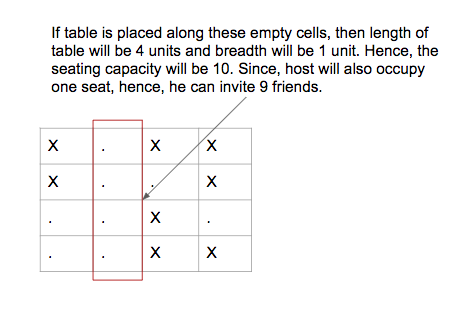

# Question

Raj is throwing a birthday party. He wants to invite as many friends as possible. He wants a large wooden table to accommodate his friends. There is constraint for this: space in the room. The number of friends a table can accommodate is equal to its perimeter (the sum of all side lengths). The furniture must be placed so that the edges are parallel to the edges of the flat.  

You will be given layout of the flat and you have to tell maximum number of friends that he can accommodate in his room.

### Input Format:

The first line of input contains two integers R and C , these are the dimensions of the flat.
Each of the following R rows contain exactly C characters. Characters can be '.', 'X'. '.' character means that cell is free and can be used for placing wooden table. 'X' means that cell is blocked and hence, cannot be used.

### Constraints:

Time Limit: 1 second  
1 <= R  
C <= 400

### Output format:

Print the maximum number of friends Raj can accommodate, if he buys his table. 

#### Sample Input:

```
2 2
..
..
```

#### Sample Output:

```
7
```

#### Sample Input:

```
4 4
X.XX
X..X
..X.
..XX 
```

#### Sample Output:

```
9
```

#### Explanation:

Please refer to the image below for explanation:


